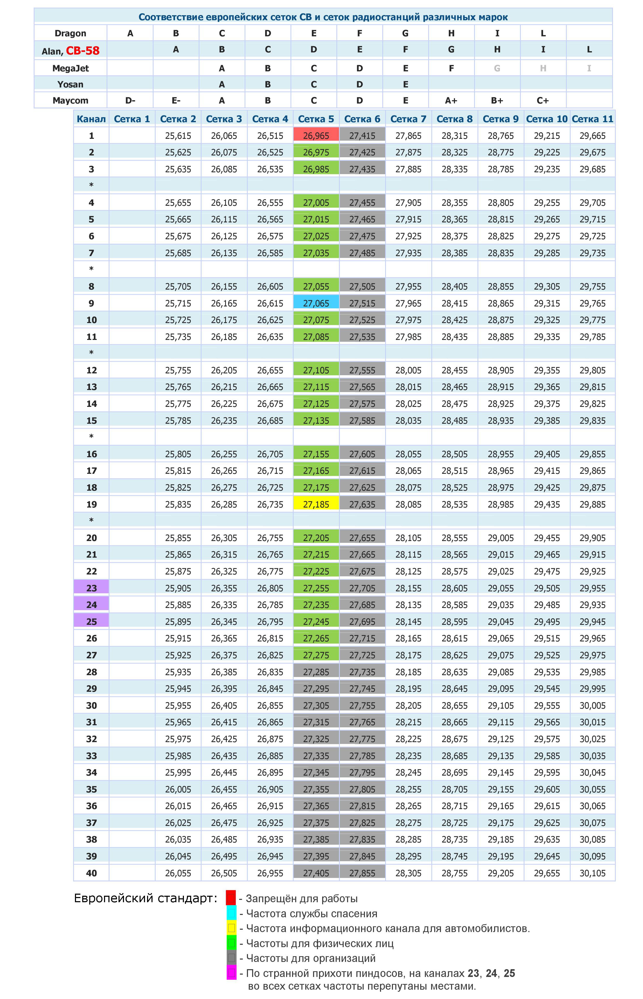

## Основные каналы и частоты для файлов dkxce_4W_D.dat, dkxce_8W_D.dat и Rossiyanin

* **D9** - **C9EF** (27.065 МГц, сетка "С", Европа, Пятерки, FM) - вызывной канал службы спасения. 
* **D15** - **C15EA** (27.135 МГц, сетка "С", Европа, Пятерки, AM) - канал дальнобойщикой.
* **D19** - **C19EF**, *C19EA* (27.185 МГц, сетка "С", Европа, Пятерки, FM/AM) - информационный канал. 

Подробнее [Wiki](https://ru.wikipedia.org/wiki/%D0%A1%D0%B8-%D0%91%D0%B8), [Rossiyanin](https://popgun.ru/viewtopic.php?f=207&t=891574), [Россиянин](http://forum.auto-cb18.ru/viewtopic.php?f=12&t=5206)
